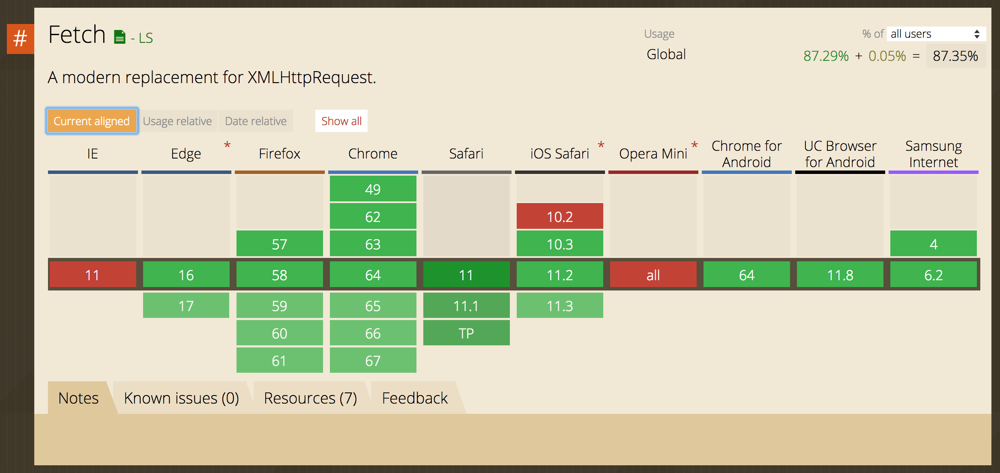

# レッスン5. CookieとHTML5 Web Storage

## 目的

- Cookie、Web Storageの概念を理解する。
- Cookie, Web Storageを利用した状態(ステート)の保存方法を知る。

## HTTP通信はステートレス

レッスン3ではHTTP通信についての基本を学びました。HTTPについて注意しておいて頂きたいのはHTTPはステートレス(状態を保持しない)なプロトコルということです。これはどういうことかというと、例えば多くのサイトではユーザーの認証を行いますが、一度ユーザーの認証が行われたとしてもその情報はHTTP通信には反映される仕組みがなく、ブラウザ側でそれを記憶する必要があるということです。そのために利用されるのがこれから解説を行う、Cookie、Local Storage、Session Storageといった仕組みです。

## Cookie

Cookieとは、サーバーがブラウザへと送信するデータです。ブラウザは受け取ったCookieを保存し、HTTPリクエストを送信する際にHTTPヘッダーに含めて送信されます。Cookieは約4KBまでしかデータを保存することが出来ないという、制限があるため用途は制限されます。Cookie情報は同じTLD(トップレベルドメイン)の場合、サブドメイン間で共有することが可能です。

### Cookieをクライアントサイドで保存する

Cookieはjs-cookieのようなNPMパッケージを利用することで操作することが出来ます。

```javascript
import Cookies from 'js-cookie';

Cookies.set('locale', 'ja-JP'); // ユーザーの使用言語に日本語を指定
```

上記の例のように、localeを設定することでアプリの表示言語をユーザーに併せて変更することなどが可能となります。

### Cookieの利用期限を指定する

Cookieの利用期限を指定することも出来ます。例えば、Webサービスにログインする際に「ログイン状態を維持する」というようなチェックボックスを見たことがあると思います。これはCookieの利用期限を指定することで実現出来ます。例えば、2週間後にCookieが切れるようにしたい場合は以下のようにします。

```javascript
import Cookies from 'js-cookie';

Cookies.set('locale', 'ja-JP', { expires: 14 }); // 14日後に期限切れとなる。
```

### Cookieをサブドメイン間で共有する

上述の通り、Cookieはサブドメイン間で共有できるという特徴があります。そのため、Cookieを使うことで、`www.example.com`というドメイン上でログインしていれば、`blog.example.com`のようなサブドメインのページ内でもログインした状態を保つことが出来ます。これを実現するには以下のようにします。

```javascript
import Cookies from 'js-cookie';

Cookies.set('locale', 'ja-JP', { expires: 14, domain: 'example.com' }); // サブドメイン間で共有
Cookies.set('locale', 'ja-JP', { expires: 14, domain: 'www.example.com' }); // 一つのサブドメインに限定する
```

### Cookieの送信をhttps(SSL/TLS)利用時のみに制限する

Cookieの送信をSSL/TLS通信上に限定したい場合には以下のようにします。

```javascript
import Cookies from 'js-cookie';

Cookies.set('locale', 'ja-JP', { secure: true });
```

## Web Storage

以前はブラウザ上にデータを保存する方法はCookieしかありませんでした。Cookieでは、データが必ずHTTPヘッダーに含まれてサーバーに送信されるため、一回一回の送信のデータ量が増えてしまう点や、保存出来るデータ量が最大4kb程度と少ないことなど欠点がありました。Web Storageはこうした欠点をおぎなうために生まれました。Web Storageでは、一般的に5MB以上の大きなデータを保存することが可能です。(保存できる容量はブラウザにより異なります。)

### Local StorageとSession Storage

Web Storageには、Session StorageとLocal Storageの２つがあります。基本的な利用方法はほとんど同じですがLocal Storageがクライアント側で消去しない限り半永久的に残り続ける(Local StorageにはCookieと異なり期限という概念がありません。)のに対し、Session Storageは、一回のセッションでのみ有効という特徴があります。そのため、Session Storageは異なるブラウザタブ上でも共有されません。

### Web Storageを利用する

1. データを保存する。

データを保存するにはsetItemメソッドを利用します。

```javascript
let myData = {
  userId: 1,
  email: "info@example.com",
  role: "admin"
}

localStorage.setItem('myData', myData);
```

2. データを取得する。

データの取得にはgetItemメソッドを利用します。

```javascript
let readData = localStorage.getItem('myData');
console.log(readData); 
/* 
{
  userId: 1,
  email: "info@example.com",
  role: "admin"
}
*/
```

3. 保存されたデータを消去する

保存したデータをキーごと消去するにはremoveItemメソッドを利用します。

```javascript
localStorage.removeItem('myData');
let readData = localStorage.getItem('myData');
console.log(readData); // => null
```

4. localStorageに保存されている全てのデータを消去する

localStorage内のすべてのデータを消去するにはclearメソッドを利用します。

```javascript
localStorage.setItem('data1', "test");
localStorage.setItem('data2', {message: "test"});

localStorage.celar();

localStorage.getItem('data1'); // => null
localStorage.getItem('data2'); // => null
```

### Session Storageの使い所

Session Storageは例えばですが、アプリケーション上の異なるページ間で共有したいデータがある場合に利用できます。例えばですが、他のユーザーへメッセージを送信するアプリケーションで、書きかけの情報を保存しておきたいことを考えましょう。

この時、以下のようなことが出来ます。

```javascript
let mailData1 = {
  receiverId: 1
  message: "これはユーザー1宛ての書きかけのメッセージです。"
}

let mailData2 = {
  receiverId: 1
  message: "これはユーザー2宛ての書きかけのメッセージです。"
}

sessionStorage.setItem('messages-user-1', mailData1);
sessionStorage.setItem('messages-user-2', mailData2);

// メッセージ画面を開いた時に下書きがないかどうか確認する。

sessionStorage.getItem('messages-user-1'); // => mailData1が得られる。
```

このようにして、他のページに移動した後に、再度ユーザー１へのメッセージを編集するページを開いた時でも書きかけのメッセージを表示することが出来ます。タブを閉じれば、こうした下書きは消えます。

### Local Storageの利用期限

上述の通りLocal Storageには期限(expiration)という概念がありません。そのため、Local Storageに保存するデータの利用期限を設定したい場合は、例えば保存するデータ上にその情報を含める必要があります。また、Local Storageはクライアント側で操作することが出来るので、場合によってはレッスン5上で紹介するJWTなどを利用して暗号化して、サーバー側のみで情報を操作出来るようにするということが必要となります。

```javascript
const forteenDays = 14 * 24 * 60 * 60 * 1000; // 14日間をミリ秒で換算したもの

let data = {
  expiry: (Date.now() + forteenDays),
  message: "14日後に期限が来るデータ"
}

localStorage.setItem('some-data', data);

// データを読み取る

let readData = localStorage.getItem('some-data');
if (readDate !== null) {
  if (readData.expiry - Date.now() >= 0) {
    // 有効
  } else {
    // 期限切れのため、データを消去する。
    localStorage.removeItem('some-data');
  }
}
```

## ブラウザの対応状況を調べる

さて、ここまでのレッスンではブラウザ対応についてはあまり触れてきませんでした。しかし実際にはLocal Storageのような仕組みはブラウザによっては対応がされていない場合もあります。例えば、レッスン3で学んだFetchも同様で対応済みのブラウザとそうでないものがあります。ここでは、こうしたブラウザごとの対応をするための基本を学んでいきましょう。

### "Can I use"を利用する

Can I useというサイトでは、利用しようとしているAPIがどのブラウザで対応済みかどうかを簡単に確認することが出来ます。

例えば、2018年2月現在、Fetch APIのブラウザごとの対応状況は以下のようになっています。



ご覧の通り、Fetch APIはIE11ではFetch APIが実装されていないことが分かります。IE11のシェアは日本国内ではまだ20%以上なので、Fetch APIをそのまま使ってしまうと、サービスによっては20%あるいはそれ以上のユーザーがサービスを使えないという自体に陥ってしまいます。

### Polyfillを使う

こうした一部のブラウザへ対応するために、NPM上にはPolyfillと呼ばれるパッケージが公開されています。例えば、whatwg-fetchというライブラリはその一つです。

- [whatwg-fetch](https://github.com/github/fetch)

```javascript
import fetch from 'whatwg-fetch';

fetch(...); // polyfillを利用することで、未対応のブラウザでもfetchが利用可能となる。
```

### メッセージを表示する

APIによってはpolyfillを利用しても対応が出来ない場合があります。例えばWebRTC APIはブラウザ間でSkypeのようなビデオ通話を行うことを可能にします。しかし、現状ではChromeやFirefoxを除くと対応が不十分です。こうした場合にはそのAPIが実装されているかどうかを調べ、未対応ならそれに対応するメッセージを表示するというような対応が必要です。

```javascript

if (window.RTCPeerConnection) {
  // WebRTCのRTCPeerConnectionが利用可能。
} else {
  // 未対応
}

```

## チャレンジ

- [チャレンジ5](./challenge/README.md)

## 更に学ぼう

- [HTTP Cookie - Mozilla](https://developer.mozilla.org/ja/docs/Web/HTTP/Cookies)
- [Web Storage API - Mozilla](https://developer.mozilla.org/ja/docs/Web/API/Web_Storage_API)